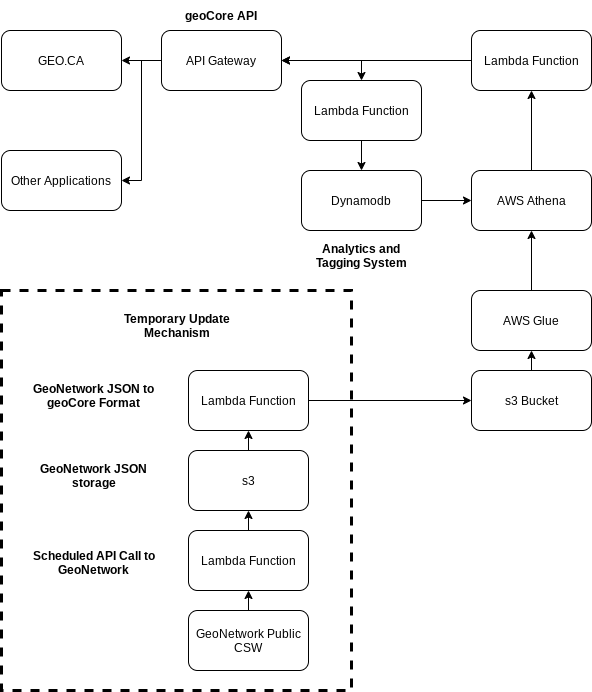

# Foundational Architecture / Architecture fondamentale
{: .no_toc }

## Table of contents / Table des matières
{: .no_toc .text-delta }

1. TOC
{:toc}

---

# Foundational Architecture

We store individual geoCore files for each item in an Amazon s3 bucket. To allow for faster search, we combine these individual files into a [parquet file](https://parquet.apache.org/). Once the parquet file is created and stored in another Amazon s3 bucket, we use [AWS Glue](https://aws.amazon.com/glue/) and [AWS Athena](https://aws.amazon.com/athena/). AWS Athena and AWS Glue work together to enable SQL queries against non-SQL data. This allows us to create sql like tables in athena using this parquet file. We can access AWS Athena with sql queries to search and discover our metadata records in the geocore data lake.

To enable the scalability of the system, we use AWS Lambda functions to carry out the main tasks of the system. This allows us to scale the system to millions of concurrent activities without endangering the functionality of the system. We use AWS lambda primarily as microservices, where one lambda function does one function, and that one function really well. It can be accessed with AWS API Gateway using AWS Cloudfront and security to enable the best protection of the system.

This lays out the foundational architecture of the geoCore system, now we will describe the additional and optional functions that we have created in the system to power [GEO.CA](https://geo.ca/).

## Architecture Overview

---

# Architecture fondamentale

Nous stockons des fichiers geoCore individuels pour chaque élément dans un compartiment Amazon s3. Pour permettre une recherche plus rapide, nous combinons ces fichiers individuels dans un [fichier parquet](https://parquet.apache.org/). Une fois le fichier parquet créé et stocké dans un autre compartiment Amazon s3, nous utilisons [AWS Glue](https://aws.amazon.com/glue/) et [AWS Athena](https://aws.amazon.com/ athéna/). AWS Athena et AWS Glue fonctionnent ensemble pour activer les requêtes SQL sur des données non SQL. Cela nous permet de créer des tables de type sql dans athena en utilisant ce fichier parquet. Nous pouvons accéder à AWS Athena avec des requêtes SQL pour rechercher et découvrir nos enregistrements de métadonnées dans le lac de données géocore.

Pour permettre l'évolutivité du système, nous utilisons les fonctions AWS Lambda pour effectuer les principales tâches du système. Cela nous permet d'adapter le système à des millions d'activités simultanées sans mettre en danger la fonctionnalité du système. Nous utilisons AWS lambda principalement en tant que microservices, où une fonction lambda remplit une fonction, et celle-ci fonctionne très bien. Il est accessible avec AWS API Gateway en utilisant AWS Cloudfront et la sécurité pour permettre la meilleure protection du système.

Ceci expose l'architecture fondamentale du système geoCore, nous allons maintenant décrire les fonctions supplémentaires et optionnelles que nous avons créées dans le système pour alimenter [GEO.CA](https://geo.ca/).

## Présentation de l'architecture

